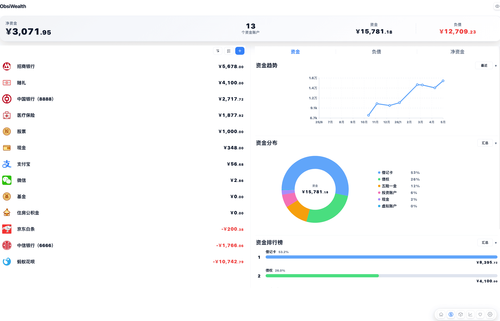
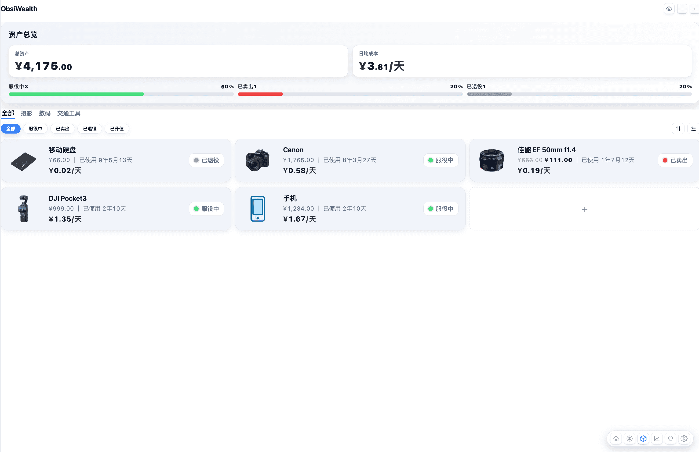
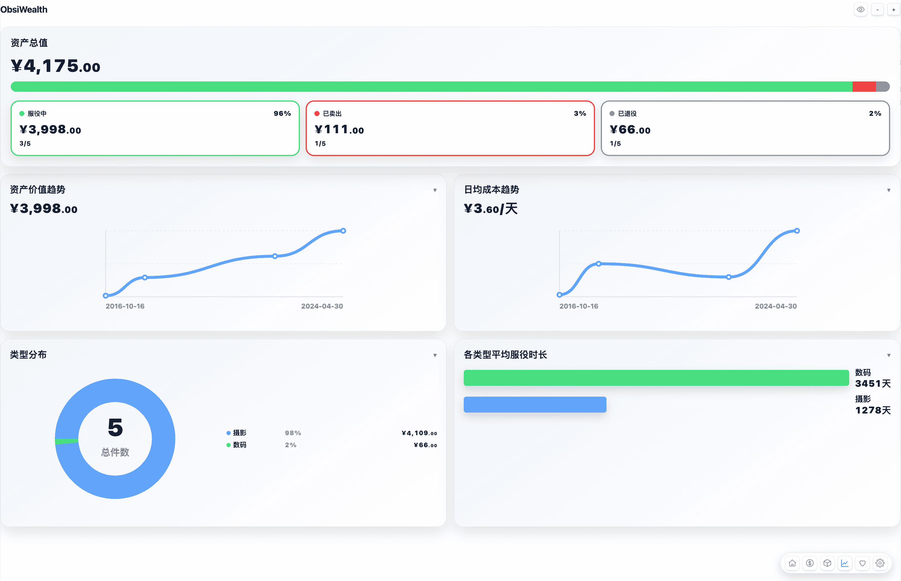
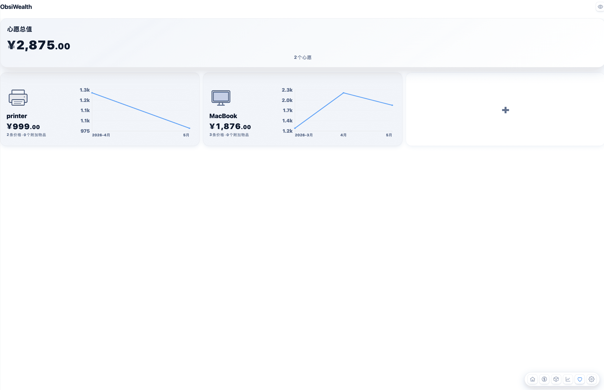

# ObsiWealth

A personal finance and asset tracking plugin for Obsidian.

## ✨ Features
- Track assets and cash flow
- Visualize financial status
- Lightweight and local-first

## 🛠️ Installation

### Manual Install

1. Download the latest release from GitHub:
   https://github.com/twelveOranges/obsiwealth/releases

2. Unzip the downloaded file.

3. Copy the extracted folder to your Obsidian plugins directory: `your_obsidian_vault/.obsidian/plugins/`

4. The final structure should look like:
    ``` 
    .obsidian/plugins/obsiwealth/
    ├── main.js
    ├── manifest.json
    ├── styles.css (may not exist)
    ```

5. Restart Obsidian and enable the plugin in Settings → Community Plugins.

## 📸 Screenshots

<div align="center">

<table>
  <tr>
    <td></td>
    <td></td>
  </tr>
  <tr>
    <td></td>
    <td></td>
  </tr>
</table>

</div>

## 📄 License
MIT License